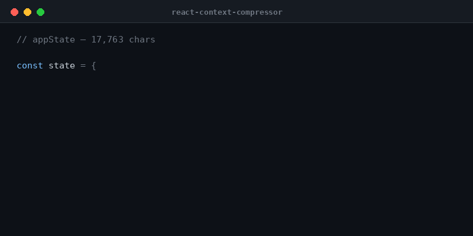

# react-context-compressor

[](https://www.npmjs.com/package/react-context-compressor)
[](https://github.com/Muhammad-UmairAli/react-context-compressor/actions/workflows/ci.yml)
[](https://bundlephobia.com/package/react-context-compressor)
[](https://www.npmjs.com/package/react-context-compressor?activeTab=dependencies)
[](./LICENSE)

A lightweight, **zero-dependency** JS/TS utility that mechanically strips
non-essential UI data and deep nesting from your application state **and**
sanitizes sensitive fields (tokens, credentials, private IDs) — producing a
minimal, safe payload to send to an LLM. It cuts token costs and avoids
context-window overflows.

It is **100% mechanical**: no network calls, no models, no AI summarization
(see [Non-goals](#non-goals)). A framework-agnostic core (`.`) plus a thin React
bindings layer (`./react`).

<p align="center">
  
</p>

```
Before: 17,763 chars  →  After: 402 chars   (97.7% smaller, secrets redacted)
```

_(from [`examples/demo.mjs`](./examples/demo.mjs) — run it yourself.)_

## Why

Sending application state to an LLM is expensive (you pay per token) and fragile
(oversized blobs overflow the context window). State is also full of data the
model doesn't need — UI flags, caches, deep view-models — and sometimes carries
**secrets that must never leave the client**. `react-context-compressor` does the
shrinking and the sanitizing in one mechanical, deterministic pass.

## Install

```sh
npm install react-context-compressor
```

`react` is an optional **peer dependency** (>= 17) — only needed for the
`./react` entry. The core has zero runtime dependencies.

## Quick start

### Core (any JS/TS — React not required)

```ts
import { compress } from "react-context-compressor";

const payload = compress(appState, {
  maxDepth: 3,
  maxArrayLength: 5,
  dropEmpty: true,
  strip: [/^_/], // drop internal/private keys
});

// `payload` is a minimal, secret-free plain object — JSON.stringify and send it.
```

### React

```tsx
import { useCompressedContext } from "react-context-compressor/react";

function useLlmContext(state: AppState) {
  // Memoized: recomputes only when `state` or the options content changes.
  return useCompressedContext(state, {
    maxDepth: 3,
    maxArrayLength: 5,
    dropEmpty: true,
  });
}
```

Works with any state source — Redux, Zustand, Context, `useState`. The hook is
pure (no DOM, no side effects), so it's safe under SSR and React Server
Components, on React 17 / 18 / 19.

## What it does

| Transform    | Option                           | Behavior                                                                                |
| ------------ | -------------------------------- | --------------------------------------------------------------------------------------- |
| Cap depth    | `maxDepth`                       | Nodes deeper than the cap become `"[Object]"` / `"[Array]"`. Default **100**.           |
| Cap arrays   | `maxArrayLength`                 | Longer arrays are truncated and a `"[+N more]"` marker appended. Default **unlimited**. |
| Strip keys   | `strip`                          | Remove keys by exact string or `RegExp`, at any depth.                                  |
| Drop empties | `dropEmpty`                      | Drop `null` / `undefined` / `""` / `[]` / `{}`. Default `false`.                        |
| Sanitize     | `sanitize`, `defaultSanitize`, … | Redact/remove sensitive fields (see below).                                             |

It also handles awkward inputs predictably: **circular references** → `"[Circular]"`,
a **throwing getter** → `"[Getter]"` (never crashes), `Date` → a copy, `Map` → plain
object, `Set` / `TypedArray` → array, `RegExp` → its source string, `Error` →
`{ name, message }`, functions/symbols dropped, `BigInt` → string. The input object
is **never mutated**, and output is **deterministic**.

## Sanitization (data safety)

By default, common sensitive field **names** are redacted to `"[REDACTED]"`
before their value is ever read:

```ts
compress({ user: "ada", apiKey: "sk-live-123", nested: { password: "p@ss" } });
// → { user: "ada", apiKey: "[REDACTED]", nested: { password: "[REDACTED]" } }
```

The built-in deny-list covers (case-insensitive): `password`, `secret`, `token`
(and `accessToken`/`authToken`/…), `apiKey`/`accessKey`/`privateKey`/`signingKey`,
`jwt`, `authorization`, `bearer`, `credentials`, `cookie`, `sessionId`,
`otp`/`totp`/`mfa`, `mnemonic`/`seedPhrase`, recovery/backup codes, `hmac`,
`signature`, `connectionString`/`dsn`/db URLs, `ssn`, `creditCard`/`cardNumber`,
`cvv`, `pin`, `iban`, routing/account numbers, `passport`, `taxId`. It's tuned to
avoid false positives like `author`, `dashboard`, `secretary`, `tokenCount`, or
`promptTokens`.

```ts
// Extend the deny-list, or remove instead of redact:
compress(state, {
  sanitize: ["employeeId", /internal/i],
  sanitizeMode: "remove",
});

// Replace the built-ins entirely:
compress(state, { defaultSanitize: false, sanitize: [/^secret_/] });
```

### Security note & limits

Sanitization is **key-name-driven** and mechanical. It is intentionally **not**:

- **Value-based** — a secret stored under an innocuous key, or as a bare array /
  `Set` element (no key), is not detected. Match it explicitly via `sanitize`.
- A defense against deliberate **homoglyph** keys — keys are NFKC-normalized and
  zero-width-stripped (defeating fullwidth/zero-width evasion), but not Cyrillic
  look-alikes.

Only own **enumerable string** keys are processed; Symbol-keyed and non-enumerable
properties are dropped (never emitted). Treat the deny-list as a strong default,
and extend it for your domain.

## API

### `compress(state, options?) → unknown`

Mechanically compress + sanitize `state`. Pure, deterministic, never mutates input.

### `useCompressedContext(state, options?) → unknown` (`./react`)

Memoized React hook wrapping `compress`. Recomputes only when the `state`
reference or the options **content** changes (an inline options literal is fine).

### `CompressOptions`

| Option            | Type                      | Default        | Notes                                                                       |
| ----------------- | ------------------------- | -------------- | --------------------------------------------------------------------------- |
| `maxDepth`        | `number`                  | `100`          | `Infinity` to disable.                                                      |
| `maxArrayLength`  | `number`                  | `Infinity`     |                                                                             |
| `strip`           | `Array<string \| RegExp>` | `[]`           | String = exact (case-sensitive) key; `RegExp` = pattern.                    |
| `dropEmpty`       | `boolean`                 | `false`        |                                                                             |
| `sanitize`        | `Array<string \| RegExp>` | `[]`           | String = case-insensitive exact; `RegExp` = pattern. Adds to the deny-list. |
| `defaultSanitize` | `boolean`                 | `true`         | Toggle the built-in deny-list.                                              |
| `sanitizeMode`    | `"redact" \| "remove"`    | `"redact"`     |                                                                             |
| `redactedValue`   | `string`                  | `"[REDACTED]"` | Used when redacting.                                                        |

## Non-goals

This library will **never** perform semantic / AI-powered summarization, make
network calls, or run a local model. It is a mechanical, zero-cost, client-side
object parser — that's the whole point (it saves you money _before_ the network
layer). See [SPLIT-PLAN §2 (out of scope)](./SPLIT-PLAN.md).

## Contributing & releasing

Development uses Git Flow: feature branches → `develop` (PR required), releases
promote `develop` → `main`.

```sh
npm install
npm test          # vitest
npm run typecheck && npm run lint && npm run build && npm run size
```

Each change adds a [changeset](https://github.com/changesets/changesets)
(`npm run changeset`). To cut a release: branch `release/X.Y.Z` off `develop`,
run `npx changeset version` (bumps the version + updates the changelog), open a
PR to `main`, merge, then tag `vX.Y.Z`. Pushing the tag triggers
[`.github/workflows/release.yml`](./.github/workflows/release.yml), which
publishes to npm **with provenance** (once an `NPM_TOKEN` secret is configured).

## License

MIT
